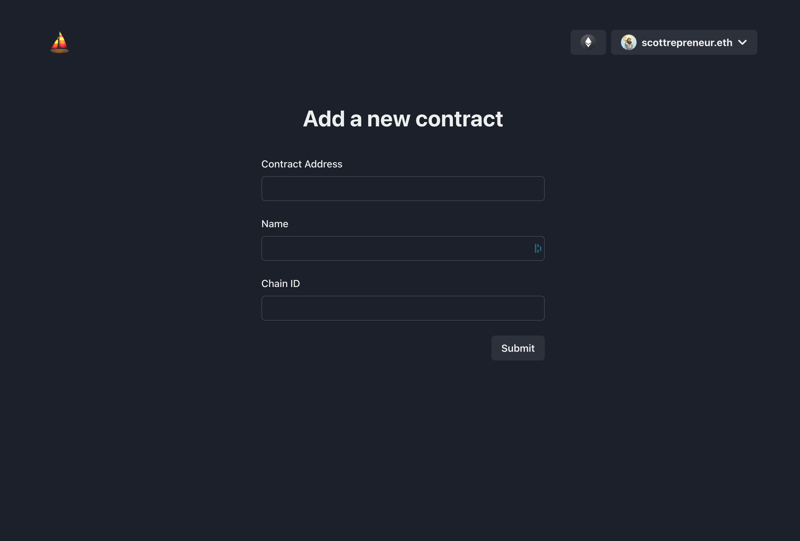

# Next + Hasura + SIWE Template


## Uses

- Node 16+ recommended
- React 18
- [Next 12](https://nextjs.org) + [NextAuth](https://next-auth.js.org)
- [Wagmi](https://wagmi.sh/)
- [RainbowKit](https://www.rainbowkit.com)
- [Chakra UI](https://chakra-ui.com/)
- [React Query](https://tanstack.com/query/v4)

Read the full getting started [here](https://me.scottrepreneur.eth.limo/posts/2022-08-16---Next-Hasura-SIWE-Template/).

## Quick Start

```bash
# bring up the db and hasura
docker compose up -d
# install dependencies for next
yarn
# start dev server
yarn dev # or yarn nx serve next-hasura-siwe
```

## Hasura API & Console

[Hasura]() is a GraphQL engine that connects to your database and provides a GraphQL API. It also provides a web interface to manage your database.

### Hasura Console

The Hasura console is a web interface to manage your database. It is available at http://localhost:8080/console.

You can reach the Hasura console by running:

```bash
yarn nx run next-hasura-siwe:hasura-console
# within `services/hasura`
hasura console
```

### Hasura Migrations

Hasura migrations are a way to manage your database schema. They are stored in the `hasura/migrations` directory. You can create a new migration by running:

```bash
yarn nx run next-hasura-siwe:hasura-migrate
# within `services/hasura`
hasura migrate apply --database-name default
```

> [Note] Replace the initial SQL migration with your own models. Or extend your models and remove that model later.

> [Gotcha] Drop your database with `docker compose down -v` and apply the new migrations.

### Hasura Metadata

Hasura metadata is a way to manage your database permissions. It is stored in the `hasura/metadata` directory. You can apply the metadata by running:

```bash
yarn nx run next-hasura-siwe:hasura-apply
# within `services/hasura`
hasura metadata apply --database-name default
```

### Hasura Seeds

Hasura seeds are a way to manage your database data. They are stored in the `hasura/seeds` directory. You can apply the seeds by running:

```bash
yarn nx run next-hasura-siwe:hasura-apply-seeds
# within `services/hasura
hasura seeds apply --database-name default
```

### Hasura JWT Auth

The default setup uses JWT Auth. Setting the `HASURA_GRAPHQL_ADMIN_SECRET` enables general Auth on the Hasura API and `HASURA_GRAPHQL_JWT_SECRET` enables JWT Auth. The JWT secret is a JSON object with the following properties:

- `type`: The type of the secret. Must be `HS256` or `RS256`
- `secret`: The secret. For `HS256`, this is a string. For `RS256`, this is a JSON object with the following properties:
  - `key`: The secret key. This can be the path to a file containing the secret key or the secret key itself.
  - `e`: The exponent for a standard PEM encoded RSA private key. Required for `RS256`.
  - `n`: The modulus for a standard PEM encoded RSA private key. Required for `RS256`.

This template defaults to `HS256`. You can change the secret in the `HASURA_GRAPHQL_JWT_SECRET` environment variable in the `docker-compose.yml` file.

### DB Tips

- Hasura has a robust permissions system. You can manage your permissions in the Hasura console.
- Enum tables are great for managing selectable columns
- Foreign keys: use `model_id` for the column name so that the `model` name can be used for the relationship name

## Frontend

Leveraging Next.js & React this template allows you to quickly spin up a new app with blockchain-based accounts. The initial layout leverages Chakra's excellent responsive breakpoints to provide a mobile-first experience.

### NextAuth

[NextAuth](https://next-auth.js.org/) seamlessly handles authentication in Next.js.

NextAuth handles all user creation and managing sessions via JWTs. Check out the [customized API endpoint here](./apps/frontend/pages/api/auth/[...nextauth].ts).

### RainbowKit

[RainbowKit](https://www.rainbowkit.com/) helps with managing wallets and connections for web3 & EVM chains.

### Wagmi Hooks

[Wagmi](https://wagmi.sh/) provides hooks for accessing blockchain contract data and writing to contracts.

### Chakra UI

[Chakra UI](https://chakra-ui.com/) gives you a simple, modular and accessible component library that easily enables accessible and responsive designs.

### React Query

[React Query](https://react-query.tanstack.com/) provides hooks for fetching, caching and updating asynchronous data in React.

## Template Basics

The template provides a basic application with working queries and mutations. We leverage a simple contracts model that contains a `name`, `address` and `chainId`. This model is used to demonstrate the other functions needed to interact with Hasura.

- Contract List (Index Page)
- Contract Detail (contracts/:address)
- Contract Form (contracts/new)

### Contract List


- [`useContractList`](./apps/frontend/hooks/useContractList.ts) hook
- `CONTRACT_LIST_QUERY` query
- Index route

### Contract Detail


- [`useContractDetail`](./apps/frontend/hooks/useContractDetail.ts) hook
- `CONTRACT_DETAIL_QUERY` query
- `/contracts/:address` route

### Contract Form



- [`useContractCreate`](./apps/frontend/hooks/useContractCreate.ts) hook
- `CONTRACT_CREATE_MUTATION` mutation
- `/contracts/new` route

